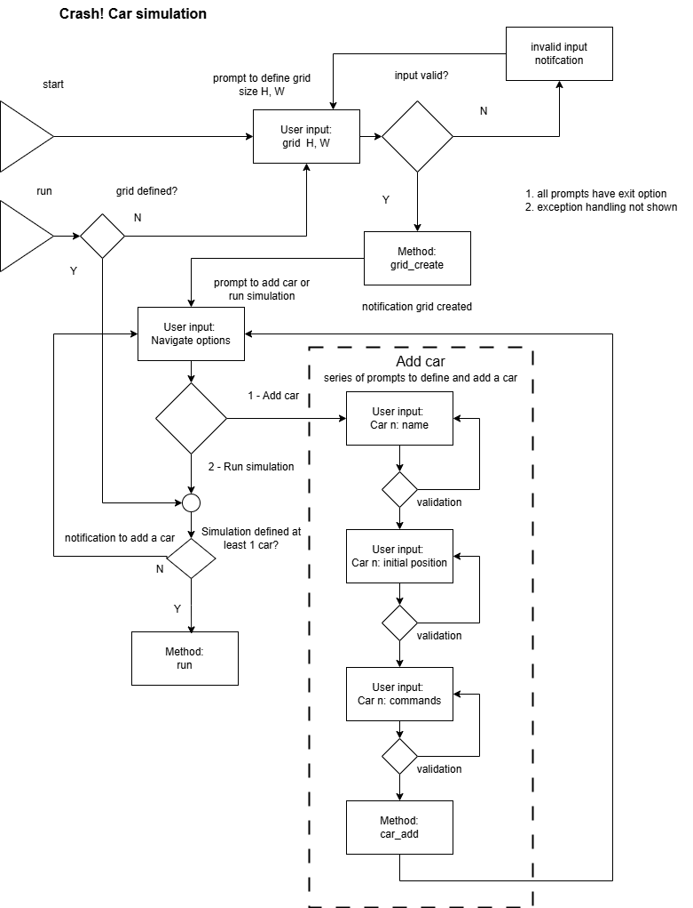

# Crash: Auto Driving Car Simulation

## Simulation description

__Overview__

You are tasked with developing a simulation program for an autonomous driving car, with the aim of competing with Tesla. Your team has already developed a prototype car, but it is still in its primitive stage.

The simulation program is designed to work with a rectangular field, specified by its width and height. The bottom left coordinate of the field is at position (0,0), and the top right position is denoted (width,height). For example, a field with dimensions 10 x 10 would have its upper right coordinate at position (9,9).

One or more cars can be added to the field, each with a unique name, starting position, and direction they are facing. For instance, a car named "A" may be placed at position (1,2) and facing North.

A list of commands can be issued to each car, which can be one of three commands:

- L: rotates the car by 90 degrees to the left
- R: rotates the car by 90 degrees to the right
- F: moves forward by 1 grid point

If a car tries to move beyond the boundary of the field, the command is ignored, and the car stays in its current position. For example, if a car at position (0,0) is facing South and receives an F command, the command will be ignored as it would take the car beyond the boundary of the field.

Users can interact with your simulation program through the command line interface. Upon launching the program 

__Simulation run: Single car__

At this point, there are a field, a car with initial position, facing, and commands available. If user attempts to run simulation, user can enter:

```
2
```

Then the system runs all the commands for car A, and responds with:

```
Your current list of cars are:
- A, (1,2) N, FFRFFFFRRL

After simulation, the result is:
- A, (5,4) S

Please choose from the following options:
[1] Start over
[2] Exit
```

If user chooses to start over, the system will show:

```
Welcome to Auto Driving Car Simulation!

Please enter the width and height of the simulation field in x y format:
```

If use choose to exit, the system will show:

```
Thank you for running the simulation. Goodbye!
```

__Simulation setup: Multiple cars__

After user adds one car to the field, user can also choose to continue to add more cars. Hence, following example above, when system responds with:

```
Your current list of cars are:
- A, (1,2) N, FFRFFFFRRL

Please choose from the following options:
[1] Add a car to field
[2] Run simulation
```

User then can enter:

```
1
```

The system then responds with:

```
Please enter the name of the car:
```

User is then able to enter:

```
B
```

The system responds with:

```
Please enter initial position of car B in x y Direction format:
```

User is then able to enter:

```
7 8 W
```

The system responds with:

```
Please enter the commands for car B:
```

User is then able to enter:

```
FFLFFFFFFF
```

Please note that the length of commands do not have to be the same. If a car runs out of command, it will stay put.

The system responds with:

```
Your current list of cars are:
- A, (1,2) N, FFRFFFFRRL
- B, (7,8) W, FFLFFFFFFF

Please choose from the following options:
[1] Add a car to field
[2] Run simulation
```

At this point, user can continue to add more cars or run simulation. If user tries to add new car, the program follows the process above. If user tries to run simulation, then user will enter:

```
2
```

__Simulation run: multiple cars__


Then the system will run all car A's commands and all car B's commands, then respond with:

```
Your current list of cars are:
- A, (1,2) N, FFRFFFFRRL
- B, (7,8) W, FFLFFFFFFF

After simulation, the result is:
- A, collides with B at (5,4) at step 7
- B, collides with A at (5,4) at step 7

Please choose from the following options:
[1] Start over
[2] Exit
```

When processing commands for multiple cars, at every step, only one command can be processed for each car and it should be sequential.

Using the example above:
- At step 1, car A moves forward, and then car B moves forward.
- At step 2, car A moves forward, and then car B moves forward.
- At step 3, car A turn right, and then car B turns left.
- So on and so forth for the rest of the commands.

If cars do not have collision, then the system will print the final positions following example in Scenario 1.

__Simulation run: exception conditions__

_exception conditions_
1. collisions
2. boundary

_collisions_
If some cars collide at certain step, then collided cars stop moving and no longer process further commands.

_boundary_
if a car is given a move that would exceed the boundary, the command is ignored. The car can still rotate at the boundary.

## General Guidelines

1. The solution should be production grade with tests , guideline on how to run code etc and following standard software engineering guidelines
2. If any assumptions are made, please document and share those as part of the submission.
3. Similarly, if you identify any gaps or areas of improvements, please identify them as well. 

## App architecture

The app architecture separates the ui `ui.py` from the simulation model `drive.py`. The state is handled using a json file from `state.py`

```
ui.py
drive.py
state.py
```

### drive model

The drive model is comprised of classes for `Car`, `Grid`, `Case`

```
Case
    - grid
    - cars

Grid
    - height
    - width
    - board

Car
    - name
    - position
    - direction
    - next_moves
```

_Case_

The case is the main operator for the simulation and contains a single `Grid` instance, and a dictionary of `Car` objects

_Grid_

The grid maintains the state of the board, with positions for each of the cars

_Car_

Each car has

_car properties_

1. name
2. position, 2D coordinate X, Y
3. direction
4. moves
5. state

_states_

| state | description|
| - | - |
| 0 | when the car it is in state 0, there are no moves to make |
| 1 | when the car is in state 1, it is free to execute moves and has moves to execute |
| 2 | when it is in state 2 = collision, it is no longer able to execute moves |
| -1 | error |

## UI



The UI controls the flow of the setup and running of the simulation, to create a smooth and intuitive experience to guide the user into setting up and running the simulation. 

The UI includes 

_UI features_

- retry loops for failed specifications for grids and cars
- navigation menus at beginning and end of tasks
- descriptive feedback on exceptions to provide clues to the cause of failure and the resolution

## Simulation

_moves_

- only the F move can change the car's position. L and R only chnage it's direction
- when the car is at the boundary, it will not advance to a new position outside the boundary, but it is free to rotate L, R or advance in directions along or away from the boundary.

## implementation

There are several implementation options

| id | option | implementation | performance | description |
| - | - | - | - | - |
|01 | simulation `simpy` | direct | ok for small, doesn't scale well | use the python package `simpy` to setup as a simulation and iterate through each round of moves |
|02 | linear algebra `numpy` | translation <-> matrix representation | fast, scales well | represent the board as a 2 x N matrix and use linear algebra for each round of moves |

_simulation_

The simulation approach is a direct interpretation of the simulation description and flexible to account for nonlinear, feedbacks and complex conditional handling for special cases such as collisions and moves at the boundary.  A drawback of the simulation method is that the performance will not scale well for very large simulations with thousands and millions of grid dimensions, cars and moves. 

_linear algebra_

The optimal implementation is option 02 linear algebra. This method would be the fastest and most computationally efficient and scales easily for very large simulation sizes. The complexity of this problem is not so difficult and the linear algebra method can be implemented with some additional development effort of translating back-and-forth between the object relational map to matrix notation

## Linear algebra implementation

In the linear algebra implementation, the program translates back-and-forth between the object model and linear algebra model. The linear algebra model performs the linear algebra operations, checks for exception conditions and advances the board state, and the object model performs additional logic and translation of the board state into the human readable interpretation of the simulation state.

__linear algebra model__

1. makes a test move
2. evaluate move valid Y/N
3. record and classify exceptions, specific cars for collisions and boundary violations
4. adjustes the move to remove exceptions, and retries until either find a valid move, or no more moves (empty matrix)
5. for a valid move, advances the board state

The linear algebra model represents the state as a matrix A, where A is a 2 x N list of N 2 x 1 vectors p_i

| symbol | name | type | description |
| - | - | - | - |
| A | position state | 2 x N matrix | 2 x N list of N 2 x 1 vectors p_i |
| p_i | car position | 2 x 1 vector | [x, y] coordinate for car i |
| m_i | car move | 2 x 2 matrix | translation matrix for car i |
| M | board move | matrix | translation matrix for all cars |

for each step, the board move matrix `M` translates the state A from current `A_{i}` to the next state `A_{i+1}`.

_board move_

```
A_{i} + M -> A_{i+1}
```

the definition of a collision is when the determinant of A^TA is zero.

_collision condition_

```
det(A^TA) = 0
```

The program operates by testing if a move is a valid move by checking the condition of the board state after the move, 
and then evalautes for exception conditions. If the move is a valid move, then it proceeds to advance the state with the new board 

_board advance_

```
A_{i+1} -> A 
```

exception conditions

1. collisions
2. grid boundary violations

For both exceptions, the model records the exception details, removes the exception moves m_i from the board move matrix M, and retries until a valid board move or until the move matrix M is an empty matrix ie no moves to make.

In the reference implementation the program translates the ORM `Case` object to
a set of matrices using `case_to_matrix`.  After each simulation step the matrix
state is converted back into the object model with `matrix_to_case`.  The helper
`linear_step` applies the pending moves sequentially and records collision
events while persisting the board state between steps.
